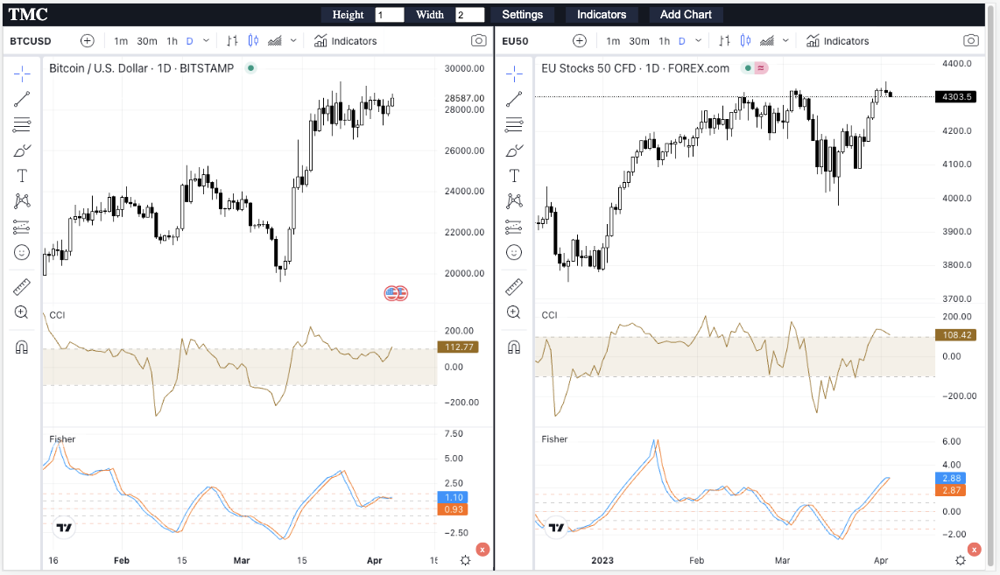
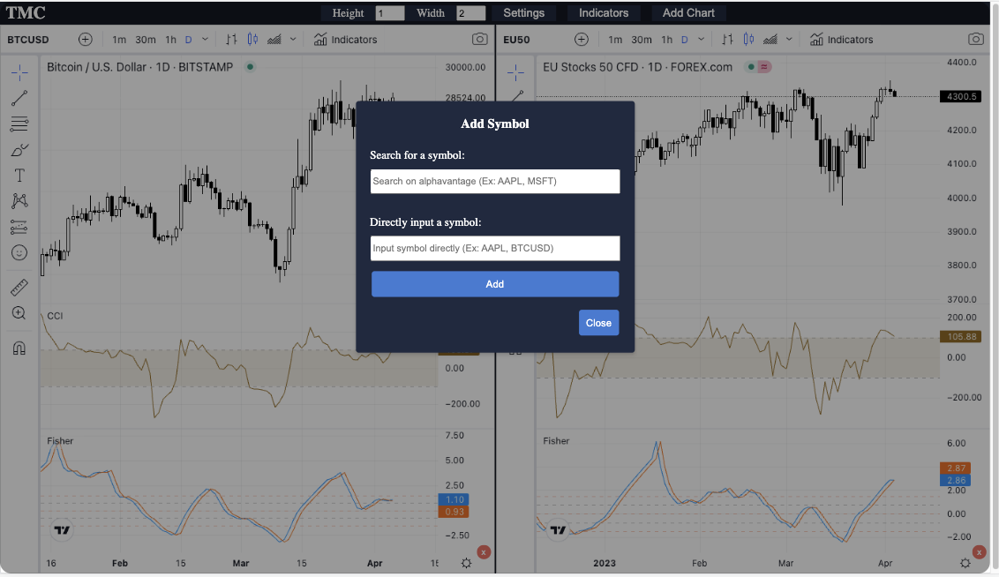
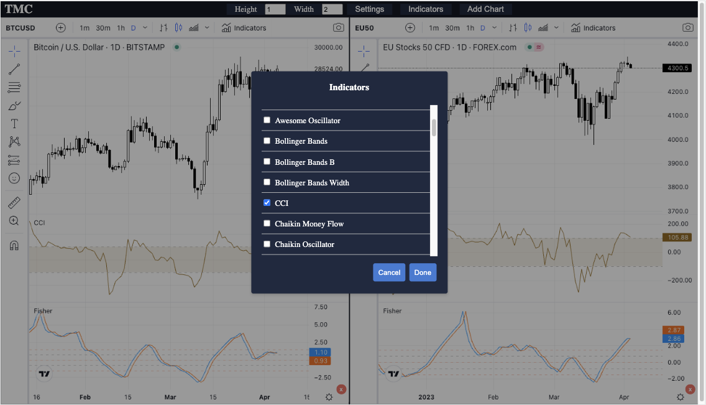

### The goal of this project is to create a customizable financial markets overview dashboard.

Deployed project : [Link](https://petrugio.github.io/charts/)

Features added:

Charting using [Tradingview widget](https://https://www.tradingview.com/widget/advanced-chart/):

* add/remove charts
* customize number of charts on the screen
* apply timeframe and chart type (ex. bar, candles) to all charts
* apply default indicators to all charts
* layout, settings and selected indicators saved to local storage - for user convenience
